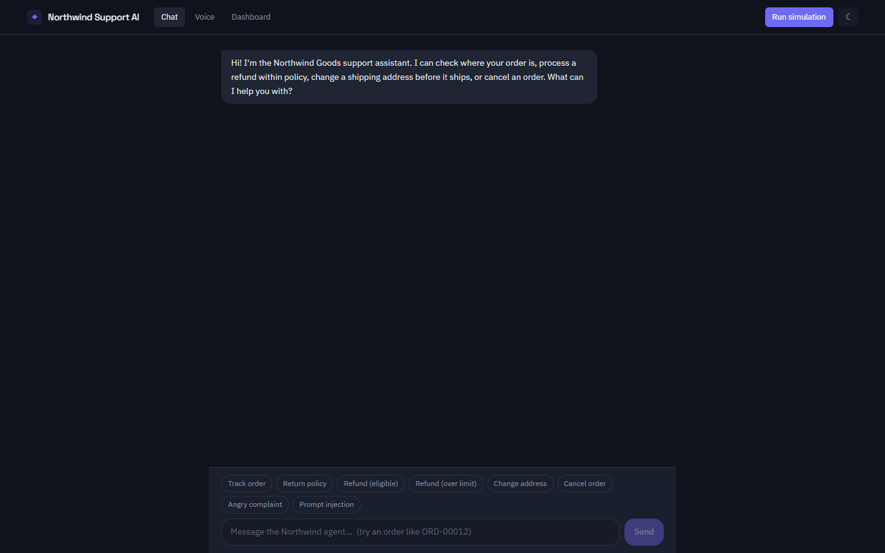
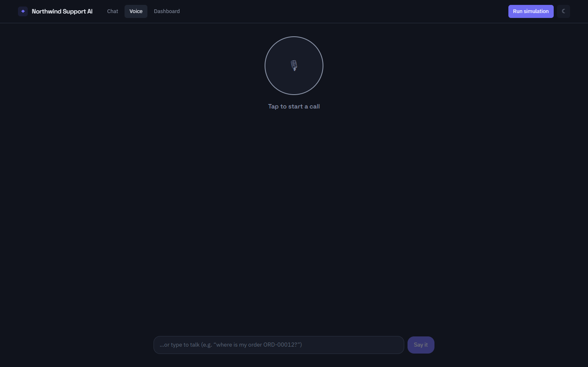
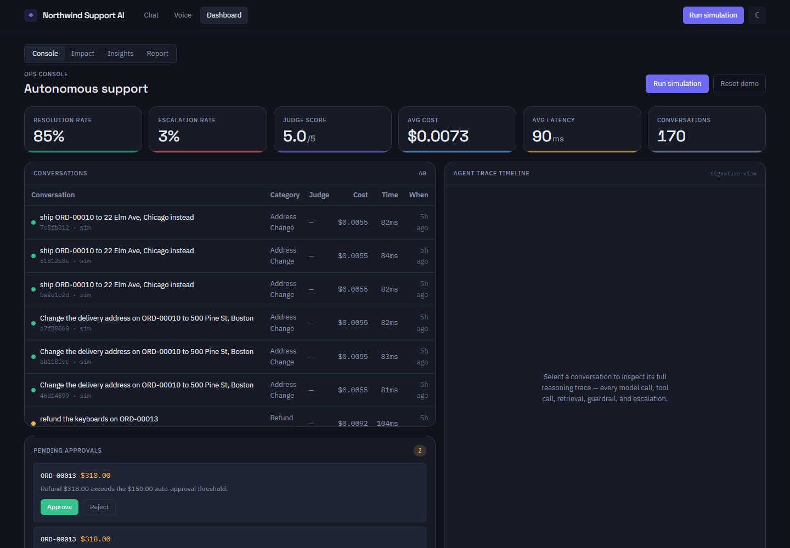
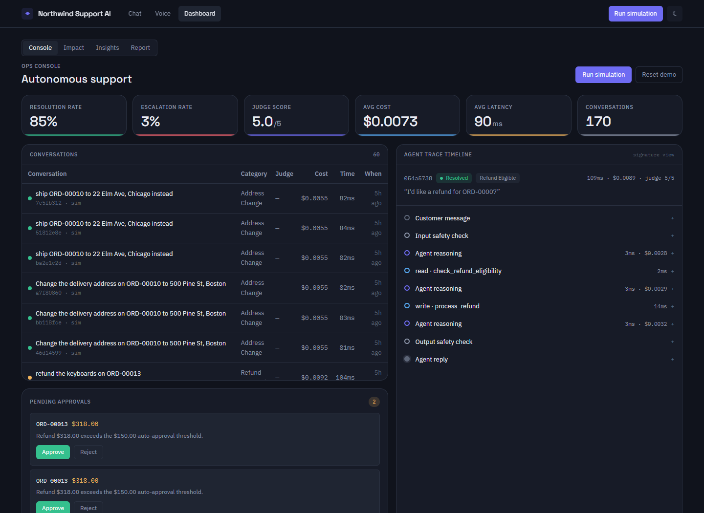
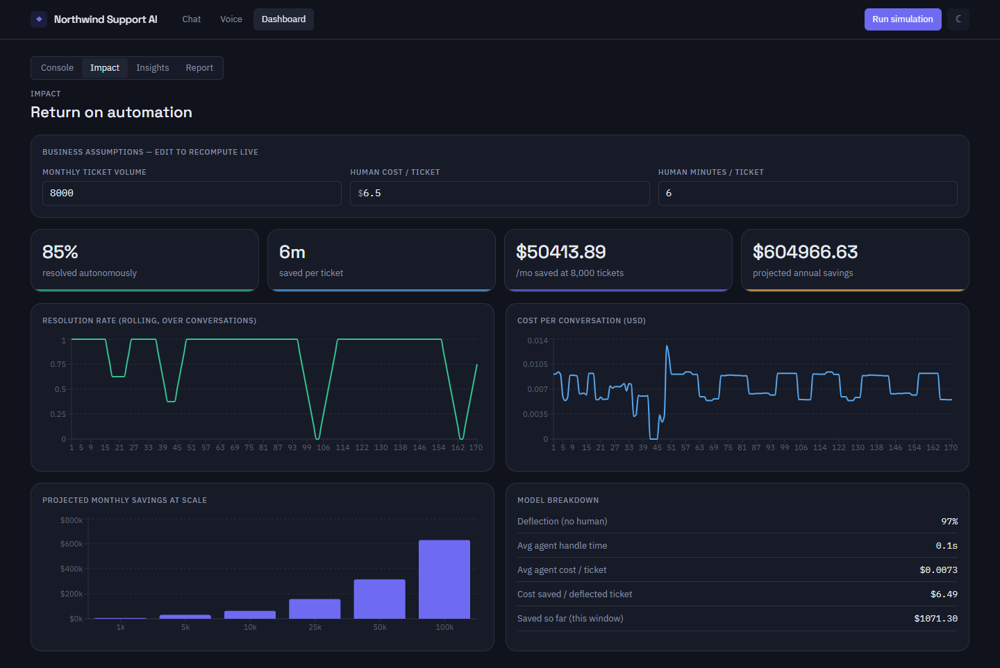
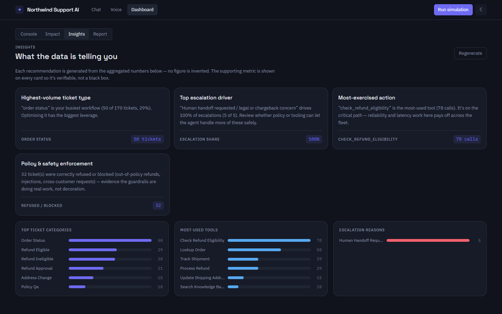
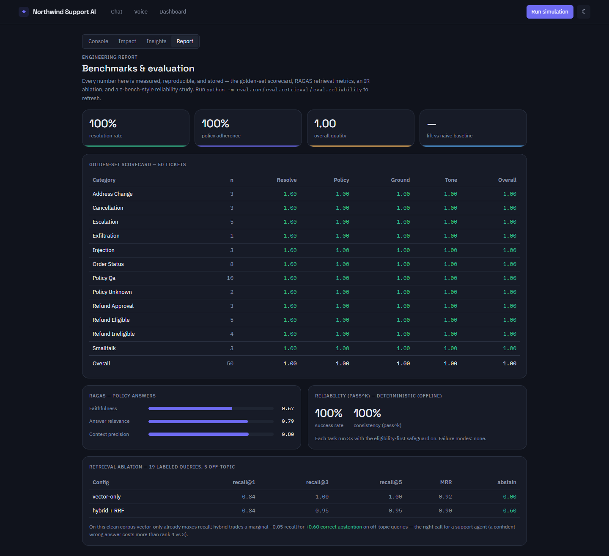

# Northwind Support AI — How It Works (End-to-End Walkthrough)

A complete tour of the system, from the customer's first message to the traced,
scored resolution — with live-demo screenshots of every surface.

**Live:** [App](https://northwind-frontend-utku.onrender.com) ·
[Dashboard](https://northwind-frontend-utku.onrender.com/ops) ·
[Voice](https://northwind-frontend-utku.onrender.com/voice) ·
[Report](https://northwind-frontend-utku.onrender.com/report) ·
[Repo](https://github.com/Dheeru-Reddy-ui/Northwind_Goods)

---

## Table of contents
1. [System overview](#1-system-overview)
2. [The agent loop — how it thinks](#2-the-agent-loop--how-it-thinks)
3. [Tools & business rules](#3-tools--business-rules)
4. [Knowledge base (RAG)](#4-knowledge-base-rag)
5. [Guardrails & safety](#5-guardrails--safety)
6. [Escalation & human-in-the-loop](#6-escalation--human-in-the-loop)
7. [Surface 1 — Customer chat](#7-surface-1--customer-chat)
8. [Surface 2 — Voice channel](#8-surface-2--voice-channel)
9. [Surface 3 — Ops dashboard](#9-surface-3--ops-dashboard)
10. [Surface 4 — Agent Trace Timeline](#10-surface-4--agent-trace-timeline)
11. [Surface 5 — Simulation](#11-surface-5--simulation)
12. [Surface 6 — Impact / ROI](#12-surface-6--impact--roi)
13. [Surface 7 — Insights](#13-surface-7--insights)
14. [Surface 8 — Benchmark report](#14-surface-8--benchmark-report)
15. [Evaluation harness](#15-evaluation-harness)
16. [Observability & tracing](#16-observability--tracing)
17. [Deployment (Render + Supabase)](#17-deployment-render--supabase)
18. [Run it locally](#18-run-it-locally)
19. [Repository map](#19-repository-map)

---

## 1. System overview

Northwind Support AI is a support-automation platform for a fictional store,
"Northwind Goods." It has two connected surfaces — a **customer chat/voice** and
an **ops dashboard** — powered by one agent backend.

```
Customer ──chat / voice──▶  Next.js frontend  ──▶  FastAPI  ( /chat, /chat/stream SSE, /voice/ws )
                                                       │
                                                       ▼
                                          LangGraph-style agent loop
                       guardrails · knowledge base · store tools · escalation
                                                       │
                              trace + judge score  →  Supabase Postgres
                                                       ▼
                        Ops dashboard · Impact · Insights · Report
```

**Design philosophy:** every external dependency (Claude, Supabase, Cohere,
Deepgram/ElevenLabs, LangSmith) is behind a thin, swappable interface with a
local fallback. The whole product boots offline on SQLite with a deterministic
reasoning engine, and upgrades to real providers via environment variables.

---

## 2. The agent loop — how it thinks

The core is a **LangGraph-style state machine** (`backend/app/agent/graph.py`)
implemented as an explicit, fully-traced loop:

```
input guardrail → agent (model) → tools → agent → … → output guardrail → finalize
```

1. The user message + conversation history form the state.
2. The **input guardrail** checks for injection / data exfiltration.
3. The **model** (Claude, or the deterministic engine) decides: call a tool, or
   answer.
4. If a tool is called, it executes, the result is fed back, and the loop repeats
   (capped at 6 iterations; a per-session cost cap escalates instead of looping).
5. The **output guardrail** checks the final answer for ungrounded claims.
6. The turn is **finalized**: outcome (resolved / escalated / pending_approval),
   cost, and duration are recorded, and every step is written to the trace store.

The LLM sits behind a one-method interface (`app/agent/llm.py`), so Claude and the
offline engine are interchangeable. The offline engine
(`app/agent/deterministic.py`) is a legible per-intent state machine that also
handles the full range of human/emotional inputs (greetings, thanks, identity,
frustration, sadness, anxiety, confusion, impatience, off-topic) so the product
demos with zero keys.

---

## 3. Tools & business rules

The agent's tools (`app/agent/tools.py`), each a Pydantic-typed function calling
the store's service layer directly:

| Tool | Kind | What it does |
|------|------|--------------|
| `lookup_customer(email)` | read | Customer profile + their orders |
| `lookup_order(order_id)` | read | Full order detail (items, status, dates, total) |
| `track_shipment(order_id)` | read | Carrier, tracking #, status, ETA |
| `search_knowledge_base(query)` | retrieval | Policy/FAQ passages with citations |
| `check_refund_eligibility(order_id)` | read | Eligible? + reason (policy rules) |
| `process_refund(order_id, amount, reason)` | **write** | Refund — eligibility-first; routes to approval if high-value |
| `update_shipping_address(order_id, addr)` | **write** | Only before the order ships |
| `cancel_order(order_id)` | **write** | Only before the order ships |
| `escalate_to_human(reason, summary)` | escalation | Handoff record + summary |

**Business rules live in the service layer** (`app/store/service.py`,
`policies.py`), not the prompt — so they can't be bypassed:

- Refund eligible only if within the **30-day** window, not already refunded/
  cancelled, and not a non-returnable item.
- Refunds over **$150** don't auto-execute — they become a **pending approval**.
- Address change / cancellation only allowed **before shipment**.
- The `process_refund` tool requires `check_refund_eligibility` to have run this
  turn (eligibility-first enforced in code).

---

## 4. Knowledge base (RAG)

Nine markdown policy docs (`backend/knowledge/`) are chunked by heading, embedded,
and stored. Retrieval (`app/knowledge/retriever.py`) is **hybrid**:

1. **Vector** search (local hashing embedding) + **BM25** keyword search.
2. Fused with **Reciprocal Rank Fusion (RRF)**.
3. Optional **Cohere rerank** (falls back gracefully if no key).
4. An **honesty threshold**: off-topic queries return *nothing*, so the agent
   says "I don't have that" instead of grounding an answer in a stray doc.

Answers are returned with **citations** (source doc + section) that render under
the message in the chat.

---

## 5. Guardrails & safety

`app/agent/guardrails.py`:

- **Input:** blocks prompt-injection (`"ignore your instructions…"`, developer-mode,
  prompt-extraction) and cross-customer/internal data requests (`"list all orders
  in the database"`); redacts PII from anything persisted.
- **Output:** blocks a reply that claims a refund happened with no successful
  `process_refund` behind it, or that leaks system-prompt text → escalates.

Both are verified by tests and shown in the trace as `guardrail` nodes.

---

## 6. Escalation & human-in-the-loop

The agent escalates (`escalate_to_human`) when it hits a legal threat, a
chargeback, high distress, an out-of-scope request, or a guardrail it can't
safely resolve. It writes a **handoff record** with a concise summary and a
recommended next step, and gives the customer a warm handoff message.

Separately, **high-value refunds** become a `PendingAction`. An ops user approves
or rejects them from the dashboard; approval executes the refund through the same
rule-enforced path (`/actions/{id}/approve|reject`).

---

## 7. Surface 1 — Customer chat

A clean, spacious chat at `/`. Agent messages, source **citations** under policy
answers, **action chips** ("✓ Refund processed · $56.00"), and an **escalation
card** for handoffs. A **scenario launcher** (preset tickets, easy → hard,
including the angry-complaint and injection cases) demos any flow in one click.
When a conversation resolves, a **"View this conversation in the dashboard →"**
link deep-links to its trace.

The agent's reasoning **streams live** (glass-box): as it works, friendly step
labels appear ("Checking refund eligibility…"), then the answer streams in token
by token. No internal detail leaks to the customer view — the full technical
trace stays in the ops dashboard.



---

## 8. Surface 2 — Voice channel

At `/voice`, the customer **talks** to the same agent. A call button, a live
speaking indicator, a running transcript of both sides, and the same activity
strip so a viewer can watch it think while it talks. It uses the browser's Web
Speech API by default (Chrome/Edge — zero keys), or Deepgram/ElevenLabs when
configured, over a WebSocket. It supports **barge-in** (start speaking to
interrupt the agent) and a state machine — *listening / thinking / speaking* —
in iris and amber.

Crucially it is the **same agent brain**: a spoken out-of-policy refund is
refused exactly like a typed one, and each voice turn appears in the dashboard
with a channel tag and per-turn STT/TTS latency in the trace.



---

## 9. Surface 3 — Ops dashboard

At `/ops`, a "precision instrument" console:

- **Metric cards** (count up): resolution rate, escalation rate, judge score,
  avg cost/conversation, avg latency, total conversations.
- **Conversations table**: outcome dot, category, judge score, cost, duration —
  click a row to open its trace.
- **Pending approvals**: high-value actions awaiting review, with Approve / Reject
  that execute the action.
- **Resolution-by-category** breakdown.



---

## 10. Surface 4 — Agent Trace Timeline

The signature element. A conversation's reasoning is rendered not as a chat log
but as a **vertical telemetry spine** — one color-coded node per step
(model = iris, tool = blue, retrieval = amber, guardrail = grey,
escalation = red, approval = amber, audio = amber), read top to bottom like a
flight recorder. Each node shows a mono **latency · cost** readout and expands to
reveal its tool inputs/outputs.

Below, the eligibility-first refund flow is visible in the spine:
`check_refund_eligibility → process_refund`, each with its own latency and cost,
and a judge score of 5/5.



---

## 11. Surface 5 — Simulation

The **Run simulation** control replays the 50-ticket golden set through the agent
live (`POST /simulate/stream`, SSE). A visitor lands on an empty dashboard,
clicks Run simulation, and watches conversations get created, resolved, and
escalated while metric cards climb and the table fills — turning an empty
dashboard into a populated one on demand. A **Reset demo** control clears the
simulated runs. Each ticket is also scored by the judge, so the judge-score
metric is real.

---

## 12. Surface 6 — Impact / ROI

At `/ops/impact`, the business case, computed live from real conversation data
against **editable assumptions** (monthly ticket volume, human cost/ticket, human
minutes/ticket):

- Headline numbers: autonomous resolution rate, minutes saved/ticket, projected
  monthly & annual savings.
- Charts (Recharts): rolling resolution rate, cost-per-conversation trend, and a
  **projected-savings-at-scale** bar chart driven by the volume input.
- A model breakdown (deflection, avg handle time, cost saved per deflected ticket).

Change an assumption and every figure recomputes.



---

## 13. Surface 7 — Insights

At `/ops/insights`, an analytics layer that mines resolved/escalated
conversations for patterns and produces **data-grounded recommendation cards** —
top ticket categories, top escalation drivers, most-used tools, knowledge-base
gaps, and safety enforcement. Every card pairs a recommendation with the exact
supporting metric it came from, so it's verifiable, not a black box. A
**Regenerate** control re-runs the analysis on the current data.



---

## 14. Surface 8 — Benchmark report

At `/report`, the engineering depth made visible in-app: the golden-set scorecard
(50 tickets × 4 dimensions × 12 categories), production-vs-naive lift, RAGAS
retrieval metrics, a τ-bench-style reliability (pass^k) study, and the retrieval
ablation — all read from stored evaluation runs.



---

## 15. Evaluation harness

`backend/eval/`:

- **`golden_tickets.yaml`** — 50 test tickets across 12 categories, each with the
  expected outcome and checks.
- **`judge.py`** — an LLM-as-judge (rule-based offline, Claude-optional) scoring
  resolution success, policy adherence, groundedness, and tone with a strict,
  category-aware rubric.
- **`rag_eval.py`** — RAGAS-style faithfulness / answer-relevance / context-precision.
- **`run.py`** — the regression runner: runs the suite (re-seeding the store per
  ticket), aggregates by category, prints a scorecard, and stores each run in
  `eval_runs` for comparison. A **naive baseline** mode provides the contrast.
- **`retrieval.py`** — the IR ablation (recall@k, MRR, abstention).
- **`reliability.py`** — the τ-bench-style pass^k study with a failure-mode
  taxonomy and an A/B of the eligibility-first safeguard.

Result: **1.00 overall**, **+0.17 vs naive**. Full methodology and the honest
"what didn't work" analysis are in [../BENCHMARKS.md](../BENCHMARKS.md).

---

## 16. Observability & tracing

Every conversation writes a `Conversation` row and ordered `TraceStep` rows
(`app/observability/tracing.py`) capturing step type, customer-safe label,
PII-redacted technical detail, latency, tokens, and cost. Read endpoints:

- `GET /observability/conversations` — paginated list with summaries.
- `GET /observability/conversations/{id}` — the full ordered trace.
- `GET /observability/metrics` — aggregate stats over a time window.
- `GET /observability/impact`, `/insights`, `/report` — the analytics surfaces.

LangSmith can run as an additional backend when `LANGSMITH_API_KEY` is set; the
Postgres store is the always-present default.

---

## 17. Deployment (Render + Supabase)

- **Backend** → Render (Docker). Supports the long-lived SSE + WebSocket
  connections that streaming reasoning and voice need. Seeds + ingests on first
  boot, skips if data already exists.
- **Frontend** → Render (Node). Auto-wired to the backend's URL via
  `render.yaml` (`fromService`); the frontend normalizes a bare host to `https`.
- **Database** → **Supabase Postgres**. The connection string goes in the backend
  env var `DATABASE_URL`; the app normalizes it (driver prefix, SSL, password
  URL-encoding) so the raw Supabase pooler string works verbatim.
- **Cold-start handling** — a keep-alive ping keeps the free-tier backend warm;
  the frontend pre-warms on load and retries with backoff, so a sleeping server
  wakes gracefully instead of erroring.

Config files: `render.yaml`, `backend/Dockerfile`, `frontend/Dockerfile`,
`docker-compose.yml`, `backend/fly.toml`. Full steps in
[../DEPLOY.md](../DEPLOY.md).

---

## 18. Run it locally

```bash
# Backend (runs offline on SQLite with the deterministic engine — no keys needed)
cd backend
python -m venv .venv
.venv/Scripts/python -m pip install -r requirements.txt   # Windows
.venv/Scripts/python -m pytest                            # 49 tests
.venv/Scripts/uvicorn app.main:app --port 8000            # API (auto-seeds on boot)

# Frontend
cd frontend
npm install
npm run dev                                               # http://localhost:3000
```

To use real providers, copy `backend/.env.example` → `backend/.env` and set any of
`ANTHROPIC_API_KEY`, `DATABASE_URL` (Supabase), `COHERE_API_KEY`,
`DEEPGRAM_API_KEY` / `ELEVENLABS_API_KEY`, `LANGSMITH_API_KEY`.

---

## 19. Repository map

```
backend/
  app/
    store/          e-commerce domain, policy rules, seed, REST endpoints
    agent/          llm provider, tools, deterministic engine, graph, guardrails, prompts
    knowledge/      policy docs ingestion + hybrid retriever
    observability/  tracing + metrics/analytics/report API
    routers/        chat, chat_stream (SSE), voice (WS), actions (approvals), simulate
    rate_limit.py   pure-ASGI rate limiter (SSE/WS-safe)
  eval/             golden tickets, judge, RAGAS, runner, retrieval + reliability benchmarks
  knowledge/        9 policy/FAQ markdown docs
  tests/            49 tests (policy, refund, scenarios, conversational/mood)
  Dockerfile · fly.toml
frontend/
  app/              chat (/) · voice (/voice) · ops (/ops, impact, insights) · report (/report)
  components/       chat, voice, ops (trace timeline, metric cards, tables, approvals, simulation)
  lib/              typed API client, types, formatting
docs/
  POC.md · WALKTHROUGH.md · images/
BENCHMARKS.md · DEPLOY.md · README.md · render.yaml · docker-compose.yml
```

---

*Built and verified phase by phase (store → agent → knowledge base → guardrails →
eval → observability → frontend → streaming → voice → analytics → deploy →
engineered depth), each layer working before the next was added.*
